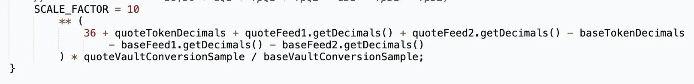

Oracle 漏洞

Morpho的十进制系统

Oracle的SCALE_FACTOR没有考虑USDC(6位小数)和PAXG(18位小数)差异,而监管的时候可能只注意到了市场参考价格没有监管Oracle给出的价格

[攻击者合约](https://etherscan.io/address/0x4095F064B8d3c3548A3bebfd0Bbfd04750E30077#code)

exp分析:
testExploit 函数是合约的核心，它通过 Uniswap V2 池发起一笔闪电贷，借入 PAXG 代币,在获得 PAXG 后，会调用 uniswapV2Call 函数，进行一系列操作，包括向 Morpho Bundler 授权、进行复杂操作（如抵押与借款），并最终偿还闪电贷。

performComplexOperation 函数用于处理与 Morpho 协议的交互，包括转移代币、抵押和借款等操作。
使用多重调用（multicall）来优化交易流程