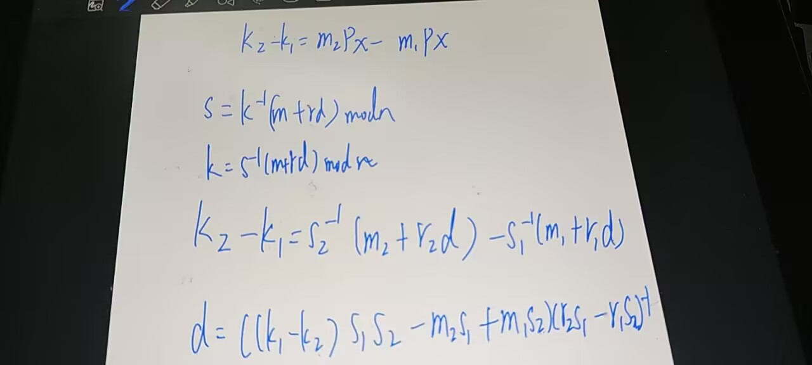

算是复习一下ECDSA
### 基础
$r$,$s$: 签名
$z$:签名的hash值，有时只需要截取最左边N位
$k$:加密的随机数，用作计算$r$和$s$

$d_A$和$Q_A$:私钥和公钥点，对消息进行签名与验证


### 签名算法（以Secp256k1为例）
通过$d_A$和$Z$就散签名对$r$和$s$
获取曲线的阶数$n$（Secp256k1的为FFFFFFFF FFFFFFFF FFFFFFFF FFFFFFFE BAAEDCE6 AF48A03B BFD25E8C D0364141）
生成一个位于$1~n-1$的随机数$k$（k不能重复使用，否则攻击者可通过其获取私钥）
计算$(x,y) = k*G$,其中$G$为曲线生成点。
计算$r=x mod n$（如果$r = 0$重算）
$s=k^{-1}(z+r*d_A)modn$（如果$s = 0$重算）

### 验证算法
计算$u_1 = z*s^{-1}modn$和$u_2 = r*s^{-1}modn$
计算$(x,y) = {u_1}*G + {u_2}* G$
对比计算$r=x modn$

这里的题就是因为random完全取决于输入的m,s，并不是真随机，反推

``` python
from miniecdsa import SN, EPoint, bigint_div_mod, bigint_sub_mod, mult, sign_ecdsa,pm1,pm2


jx1 = 0x53b907251bc1ceb7ab0eb41323afb7126600fe4cb2a9a2e8a797127508f97009
jy1 = 0xc7b390484e2baae92df41f50e537e57185cb18017650a6d3220a42a97727217d 
JP1 = EPoint(jx1,jy1)
JPM1=mult(JP1,pm1)
JPM2=mult(JP1,pm2)
deltav=bigint_sub_mod(JPM2.x,JPM1.x,SN)
d=bigint_div_mod(deltav*pm1*pm2-pm2*pm1+pm1*pm2,pm2*pm1-pm1*pm2,SN)
r,s=sign_ecdsa(d,pm1)
print(hex(r),hex(s))
```